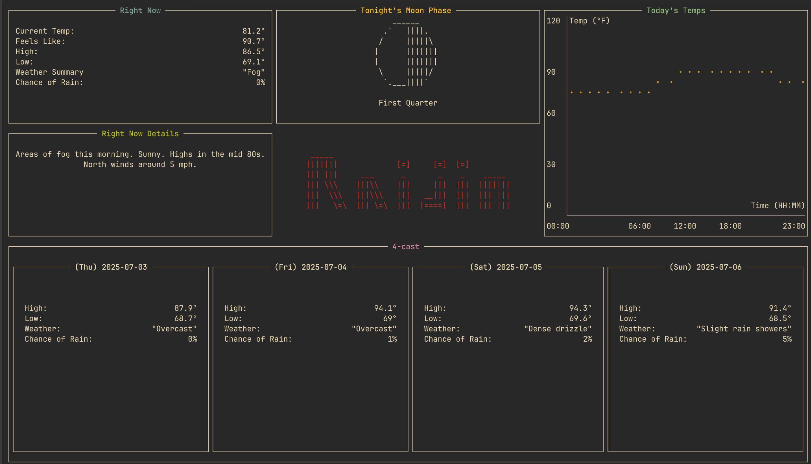

<div align="center">
  <h1>Raijin</h1>

<br />

  <p>
    A free, simple weather TUI that pulls data without the need for an API key, account, or subscription. Weather data is from <a href="https://api.weather.gov/">NWS</a> and <a href="https://open-meteo.com/en/docs">OpenMeteo</a>. Moon phase data is from <a href="https://viewbits.com/docs/moon-phase-api-documentation">ViewBits</a>. <br /> Only supports Linux at the moment.
  </p>

</div>

<div align="center">
  
  <p>
  <sub>
  (NOTE: I'm using WezTerm with the "Gruvbox Dark (Gogh)" theme. Yours may look slightly different)
  </sub>
  </p>
</div>

<br>

## Installation

### Cargo

Installation via `cargo` can be done by installing the [Raijin](https://crates.io/crates/Raijin) crate:
```bash
cargo install Raijin
```
`NOTE: The default location is Knoxville, TN. If you'd like to change it, continue on to the Configuration section below`

<br>

## Usage

Once you've completed the instructions below, run by typing `Raijin` in your terminal

First, you'll need to get some data about your location (namely, your latitude and longitude)
- Navigate to the [NWS](https://www.weather.gov/) website
- Type in your location in the top left search bar and click `Go`
- Once the page has loaded, look up at the URL search bar at the top of your browser and jot down the latitude and longitude for this location
- Then, scroll down to the `Additional Forecasts and Information` section
- Find and click the link that says `ZONE AREA FORECAST FOR <COUNTY>, <STATE>`
- In the URL search bar at the top of your browser, you should now see a zoneId at the end of that URL. It will be in the form of `<STATE>Z123` (e.g. TNZ069 which is for Knoxville, TN; in Knox county). Jot this down

Next, you need to figure out what timezone you're in and its IANA name
- Navigate to the [AddEvent](https://www.addevent.com/c/documentation/tools/time-zone-lookup) website to look this up for free
- Type in your location using the `CITY, STATE` format (e.g. Knoxville, TN) and hit `Enter`
- Once a timezone pops up, click the green `Copy` button for that result to copy the timezone to your clipboard

Now that we have the 5 pieces of data we need (latitude, longitude, 2-letter state code, weather zone ID, and timezone), let's put them into an environment file
- Navigate to `~/.config/Raijin/.env` on your machine
- Edit this file and update it with the fields you collected (make sure they have double-quotes around them like in the example)

<br>

## Develop
When editing the logo.txt or any of the moon phases, make sure every line has the exact same length (even if there are just blank lines). This will ensure that it can be centered and manipulated properly by Ratatui.

<br>

## TODO
I did this project over the course of a week to continue sharpening my Rust skills as well as work with the Ratatui library. While I'm proud of what I made, I am a little burned out due to working on it a lot in such a short time. That being said, if/when I come back to it here's what I'd like to add (or you can contribute!):

- Use [clap](https://crates.io/crates/clap) to add command-line parsing. (This would make it easier to view `help` documentation. As well as provide a way to change the config file arguments without having to edit a file directly. Not a huge deal, but would be nice to have)
- Tidy up the code. (I am by no means a great Rust programmer and I'm sure I've done a lot that isn't very idiomatic. <sub>You know, like naming my crate with a capital letter? lol</sub>)
- Rework config file setup. (Right now the way I create a config file for this is pretty lazy by just looking under `~/.config` and creating a file. But this can break if people have this symlinked for dotfile stuff. I'm sure there's a more robust way to do this) 

<br>

## Why "Raijin"?
I went googling around for mythological god names related to weather/storms. "Raijin" sounded the coolest
