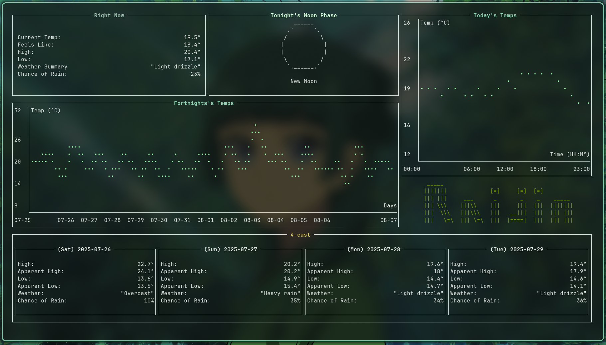

  <h1>Raijin</h1>

  
  

  
  (NOTE: The weird formation of the x-axis's labels is due to ratatui; I will look at it again, when they fix that)
  
  

 

## Why?

This is an adaption of Raijin (https://github.com/MasonStooksbury/Raijin).  
Usable for Non-US-Americans and a tad more info.
